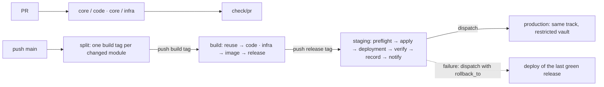

# pipelines

One pipeline for every project, whatever its language and whatever its cloud.
A repository declares its **modules**; this repository checks, builds, tags and
deploys each module on its own track, and **generates and verifies** the
workflows so no project can drift from the standard.

Nothing here knows a language or a provider: that is data from
`.github/modules.json`, the toolchain a module's `mise.toml` declares, the
scripts of its `ci/` directories and the secrets of its ward vaults. Heroku,
Cloud Run, Kubernetes and ECS Fargate all fit the same hook vocabulary
([examples/](examples/README.md)).

```
modules/core/
  code/   mise.toml · ci/{lint,audit,test,build}.sh
  infra/  mise.toml · ci/{validate,plan,apply,deployment,verify}.sh
```

## What runs when

A project has exactly four workflows, **generated** from its registry:

| event | workflow | what happens |
|---|---|---|
| pull request | `pr.yml` | `conform` → `detect` → per changed module and side: `code` (`lint · audit · test`) and `infra` (`validate · plan`) → `check/pr` |
| push main | `main.yml` | `conform ∥ detect` → `build / split`: one **build tag** `build/<module>.YYYY-MM-DD.NNN` per changed module |
| push build tag | `build.yml` | one run per module: `conform ∥ target` → `build`: `reuse / code` → `code` and `reuse / infra` → `infra` (the sides changed since the last release, minus what the pull request proved) → `image` → `release` (publishes the release tag, deletes the build tag) |
| push release tag | `deploy.yml` | staging: `preflight → apply (only when infra changed) → deployment ∥ migrate → rollout → verify → record → notify` (`migrate` and `rollout` are optional hooks) |
| dispatch | `deploy.yml` | production: the same track, on the ref; **never builds** |
| failed deploy | `deploy.yml` | a **rollback**: the deploy dispatches this workflow on its own ref with `rollback_to=<last release recorded green>`, and the same track raises that release |

Every module is a **track**: a group of parallel, independent jobs in the `pr` run, and a run of its own
in build and deploy. A failing module never stops another one. No job fans out through a strategy: every module
and every step is a literal job. The `pr` graph reads `<module> / <side> / <job>` (`core / code / test`); a build
run reads `build / code / test` and `build / image`, named by its build tag.


```mermaid
flowchart LR
  pr[PR] --> lanes["core / code · core / infra"] --> gate["check/pr"]
  main[push main] --> split["split: one build tag per changed module"]
  split -->|push build tag| build["build: reuse → code · infra → image → release"]
  build -->|push release tag| staging["staging: preflight → apply → deployment → verify → record → notify"]
  staging -->|dispatch| production["production: same track, restricted vault"]
  staging -.->|failure: dispatch with rollback_to| rb["deploy of the last green release"]
```

- **The tag exists only if the image does.** `split` names the release and pushes the build tag
  `build/<module>.YYYY-MM-DD.NNN`; the build runs the `build` hook under that name (the hook
  receives it as `TAG`) and `release` publishes the release tag only after the image was built,
  then deletes the build tag. Pushing the release tag is the order to deploy staging. A build tag
  left behind marks a build that did not succeed; a newer build of the same module cancels an older one.
- **A rollback is a deploy.** There is no rollback hook: a failed deploy dispatches a deploy of the
  last release recorded green in the environment, which runs `apply`, `deployment`, `verify` and the rest
  like any other. It never chains, and it is skipped when a newer release is already queued.
- **Staging and production are the same track.** Only `environment` differs, and
  the event decides it. Production never builds: it raises what staging recorded
  green (`record`).
- **The build reuses what the pull request proved.** A check is skipped only when
  the merged pull request was green on it and tested exactly the content that  was merged.
- **`check/pr` is the only check a ruleset needs.** It always runs and sums up
  every other job; a pull request that touches no module still reports it.

## Adopting it

1. `.github/modules.json` — the registry:

   ```json
   {
     "shared": [".github/", ".ward/", "Makefile"],
     "extra_workflows": [],
     "modules": {
       "core":    { "services": ["postgres"] },
       "gateway": {}
     }
   }
   ```

2. Per module and per side: the `mise.toml` and the hooks of the vocabulary.
   **Every hook is mandatory**; a module with nothing to do keeps a script that
   prints why and exits 0. The hook is the implementation; `make core.test` from `br4zz4/commons` runs the same hook locally.
3. `.github/actions/setup/action.yml` — authentication only (see
   [examples/](examples/README.md)).
4. Ward: the vaults `<project>` (test, staging and the pipeline's own
   `secrets.ci`) and `<project>::restricted` (production), committed encrypted.
   GitHub holds only `WARD_KEY_<PROJECT>` and `WARD_KEY_<PROJECT>_RESTRICTED`.
5. Generate the workflows once, by hand, and commit them with the rest:
   `python3 actions/conform/render.py --root .` (a pull request runs the workflows
   of its own branch, so the first ones must come with it). From then on
   `conform` keeps them in sync: when the registry changes it regenerates and
   commits them to the branch (`ci: render workflows`) and the next run is the
   real one.
6. Protect `main` with a ruleset that requires one status check: `check/pr`
   (GitHub Actions integration, id `15368`; `strict: true`, branch up to date). Create it **after** the first
   generated `pr.yml` is on `main`, or every pull request waits for a check that
   never reports.

Run the generator by hand with
`python3 actions/conform/render.py --root <project> [--ref v2]`: `--ref` is the tag of this
repository the workflows call, and `conform` passes the tag it was itself called with.
The `::restricted` vault is optional until a project has production secrets; without it a
production dispatch stops in `preflight` asking for the restricted key.

A pre-release tag is cut with `sh tasks/release.sh <name> --push`: it is a
commit with every internal reference rewritten to the tag, so a consumer on the pre-release
never reaches code of `v2`.

## Promote

A project that adds `"promote": {}` (or `"promote": {"max_per_day": 10}`) to `.github/modules.json`
gets a generated `promote.yml`. The staging deploy dispatches it only when it ends green, so a failed
staging deploy starts no promote. It runs for the release tag and sends that same release to production when it is proved:

```
deploy (staging, tag push) ─► promote: regression ∥ e2e ─┬─► promoted ─► deploy (production)
                                                          └─► failed ───► Critical issue
```

- **`regression`** — hook `run/regression` (or `ci/checks/regression.sh`): the whole suite and the
  slow tests, on a runner with the module's `services`, on the commit of the tag, with the `test`
  ward scopes. A pull request only runs the tests its change touches: the `test` hook receives
  `BASE_SHA` (the merge-base, empty on main) and decides what is impacted.
- **`e2e`** — hook `run/e2e` (or `ci/checks/e2e.sh`): real tests against the Release URL, with the
  `staging` ward scopes and `TARGET_URL`. The tests live in `<code_dir>/e2e/`, never in `test/`.
- **Release URL** — the `verify` hook writes `release_url=<url>` next to `url=`; it is required in
  staging and is kept in the deployment record. A provider without a URL tied to the release writes
  its default environment URL.
- **Outcomes** — `promoted` (records an `promoted` deployment and dispatches the production deploy),
  `superseded` (a newer release is green in staging, or production already runs a newer one),
  `capped` (`max_per_day` promotions in the last 24 hours) and `failed`.
- **Critical issue** — a failed hook opens `bug: <module> <hook> failed on <tag>` labelled
  `urgency:critical` and `module:<m>` (the same open issue gets a comment instead of a new one).
  When an `autofix` pull request landed since the last promoted release it also gets
  `autofix:blocked`. A failed production deploy opens the same issue, always `autofix:blocked`.
- **Production** — with `promote` on, the production `preflight` requires the `promoted` record;
  a manual dispatch needs `force: true`. The GitHub environment `production` must not require
  reviewers, or the automatic dispatch waits for an approval.

## Enforcement

`conform` is the first job of every run. It regenerates the workflows from the
registry and fails when:

- a generated workflow differs from the render;
- `.github/workflows/` holds a file that is not `pr`, `main`, `build` or `deploy` (or `promote`
  when the registry has the `promote` key) and is not listed in `extra_workflows`;
- a restricted ward key is mentioned anywhere but `deploy.yml`;
- a module lacks a hook of the vocabulary, has a script outside it, or has no
  `mise.toml`;
- `.github/actions/setup/action.yml` is missing;
- the ward config lacks a default vault and its `::restricted` pair, or a module
  asks for a service outside `postgres` and `redis`.

On a pull request from the same repository it fixes the workflows and commits;
everywhere else it only reports.

## Workflows of this repository

| file | level | role |
|---|---|---|
| `code.yml` | reusable | `lint`, `audit` and `test` of one module's code side, in parallel |
| `infra.yml` | reusable | `validate` and `plan` of one module's infra side, in parallel |
| `build.yml` | reusable | the checks, image and release tag of one module, started by a build tag |
| `deploy.yml` | reusable | the deploy track of one release in one environment |
| `promote.yml` | reusable | `regression` and `e2e` of a staging release, then `promote` or a Critical issue |
| `self.yml` | — | this repository checks itself |

Actions: `conform` (and `render.py`), `detect`, `split`, `target`, `releases`, `rollback`, `reuse`, `step`
(secrets → toolchain → cache → setup → hook), `hook`, `tag` (next name), `stamp` (publish the release tag),
`requirements`, `resolve`, `record`, `notify`, `gate`, `promote`, `critical`.

## Requirements

`blacksmith-*` runners, `python3`, `git` and `gh` are all the pipeline itself
needs, plus `br4zz4/setup-ward` for the secrets and `mise` for the toolchain.
Anything else — a language, a cloud CLI, docker — belongs to the module's
`mise.toml` and scripts.

See [docs/contract.md](docs/contract.md) for the registry, the vocabulary, the
secrets, the tags and the edge cases, and [docs/CONTEXT.md](docs/CONTEXT.md) for
the glossary.
